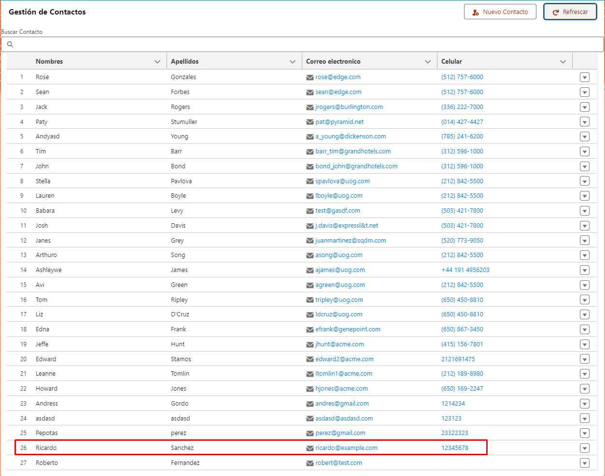
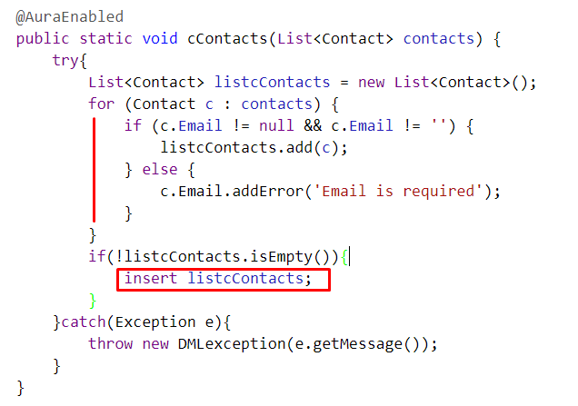

# Salesforce DX Project: Gestion de Contactos

El objetivo de este Readme es explicar la funcionalidad expuesta para el componente personalizado c/gestionContactos.

## Gestion de contactos

Es un componente LWC que se se conecta con la clase APEX 'ContactManagementSystemController' la cual expone toda la funcionalidad básica para la creación, modificación, eliminación y visualización de contactos de una organización de salesforce.

## Funcionalidad
### Visual principal

### Crear Contacto

Clic en "Nuevo Contacto"

Diligenciar el formulario de manera correcta y clic en "Guardar"

Se habrá creado el contacto.

Clic en refrescar para ver el nuevo contacto.

### Funcionalidad de buscar contacto

Clic en Buscar contacto y escriba el nombre del contacto ejemplo 'Ricardo'.
Automaticamente la data-table se filtrará. Si quiere ver de nuevo todos los datos borré el nombre.

### Editar un contacto

Para editar un contacto deberá seleccionar el registro de la tabla que quiere editar lo puede buscar más rápido usando el filtro, una vez indentificado el contacto clic en la opción desplegable y clic en "Editar".

Se abrirá un modal de edición con los valores del registro seleccionado, edite los campos que requiera y clic en "Modificar".

El contacto se modifico correctamente

Verificamos la modificación refrescando la tabla.

### Eliminar un contacto

Para eliminar un contacto deberá seleccionar el registro de la tabla que quiere editar lo puede buscar más rápido usando el filtro, una vez indentificado el contacto clic en la opción desplegable y clic en "Eliminar".

Se abrirá un confirm, deberá aceptar si esta seguro de eliminar el contacto.

El contacto se ha eliminado

Verifiquemos que el contacto ya no existe refrescando la tabla.

## Refactorización

Se hace uso de la lógica APEX entregada, dónde se agrega el manejo de errores Try Catch, se cambia la lógica para optimizar recursos, eso incluye el cambio de transacciones DML fuera de ciclos For, ya que esto es una mala práctica porque puede incurrir en los limites de la organización.

Se optimiza la consulta SOQL para que filtre los contactos sin Email de esa manera nos ahorramos un for que recorra y separe los contactos sin Email.

Se anexa un análisis previo de los puntos de mejora de la lógica inicial (Disculpen la imagen).

De igual manera se crea la clase test 'ContactManagementSystemControllerTest' gestionando toda la cobertura de la solución.

## Instalación Paquete

Para realizar la instalación de este recurso se realizó la creación de un paquete.

Realice la instalación mediante el siguiente link:

 https://login.salesforce.com/packaging/installPackage.apexp?p0=04tHu000003X5aM

Ingrese al link, e inicie sesion en la organizacion que desea instalar el paquete:

Aparecera la siguiente ruta de instalación, seleccione las opciones de la imagen y clic en "instalar".

Se habrá instalado correctamente, clic en "Listo".

Podrá verificar la correcta instalación del paquete en configuración > paquetes instalados:

### Agregar LWC a página lightning
Para poder probar la funcionalidad del componente dirijase a la página de registros de contactos de la organización por ejemplo y seleccione un contacto.

Una vez en está vista clic en configuración, modificar página.

En personalizado verá el componente LWC:

Arrastrelo a cualquier parte de la página:

Clic en "Guardar" y active la página:

Clic en Asignar como predeterminada y siga los pasos:

Ya se activo:

Clic atrás

Listo estará instalado el componente de manera funcional.

## Instalación CLI 

De igual manera puede realizar la instalación mediante Salesforce CLI autorizando la organizacion a la cual quiere realizar el despliegue de los componentes que los encontrará en la siguiente ruta:

force-app\main\default:
classes\ContactManagementSystemController.cls
classes\ContactManagementSystemControllerTest.cls
lwc\gestionContactos

Una vez desplegados todos los componentes deberá realizar el mismo paso de agregar el LWC a una página lightning especificado en el punto de instalación paquete "Agregar LWC a página lightning".

## Salesforce DX Project: Next Steps
Now that you’ve created a Salesforce DX project, what’s next? Here are some documentation resources to get you started.

### How Do You Plan to Deploy Your Changes?

Do you want to deploy a set of changes, or create a self-contained application? Choose a [development model](https://developer.salesforce.com/tools/vscode/en/user-guide/development-models).

### Configure Your Salesforce DX Project

The `sfdx-project.json` file contains useful configuration information for your project. See [Salesforce DX Project Configuration](https://developer.salesforce.com/docs/atlas.en-us.sfdx_dev.meta/sfdx_dev/sfdx_dev_ws_config.htm) in the _Salesforce DX Developer Guide_ for details about this file.

### Read All About It

- [Salesforce Extensions Documentation](https://developer.salesforce.com/tools/vscode/)
- [Salesforce CLI Setup Guide](https://developer.salesforce.com/docs/atlas.en-us.sfdx_setup.meta/sfdx_setup/sfdx_setup_intro.htm)
- [Salesforce DX Developer Guide](https://developer.salesforce.com/docs/atlas.en-us.sfdx_dev.meta/sfdx_dev/sfdx_dev_intro.htm)
- [Salesforce CLI Command Reference](https://developer.salesforce.com/docs/atlas.en-us.sfdx_cli_reference.meta/sfdx_cli_reference/cli_reference.htm)

